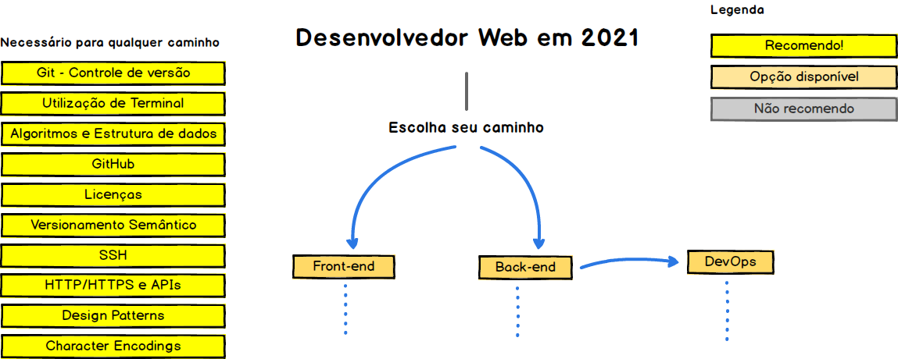
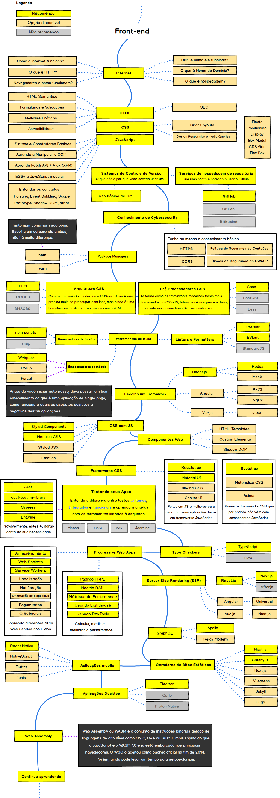
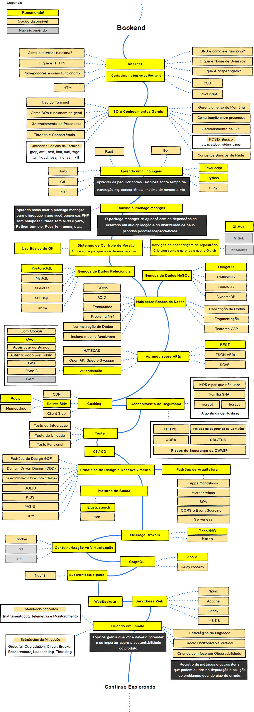
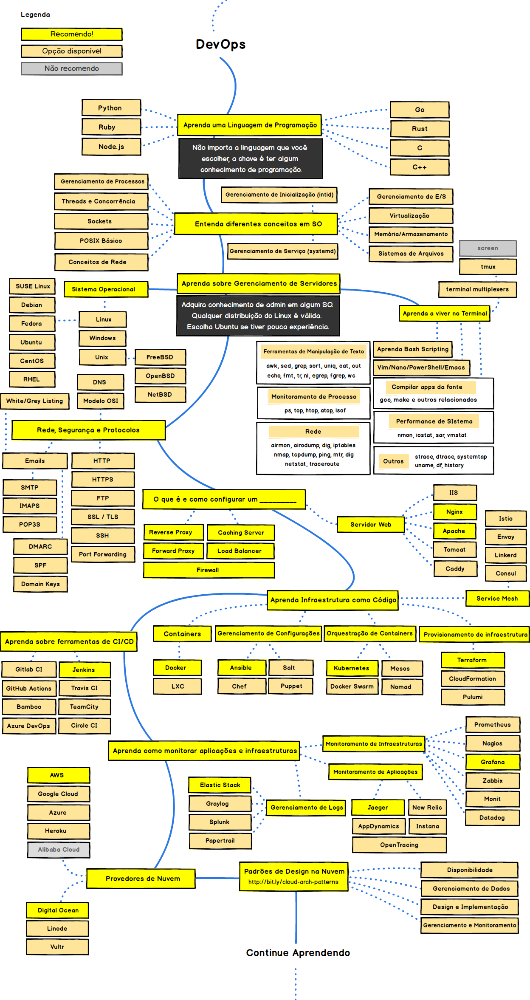

## :dart: O roadmap para alavancar a sua carreira

Abaixo você encontra, de forma visual, os caminhos que você pode tomar e as tecnologias para incorporar na sua stack para se tornar um profissional atualizado e diferenciado em frontend, backend e/ou devops. 

Diga "Oi"  
https://www.youtube.com/channel/UCwqWw3WUgFYnpPi_Z4OohpQ/videos

## :warning: Nossa proposta
> A proposta deste roadmap é dar uma ideia sobre o atual panorama e guiá-lo se você estiver confuso sobre qual o próximo aprendizado, não influenciar você a seguir os 'hypes' e 'trendys' do momento. Acreditamos que com um <b>maior conhecimento das diferentes estruturas e soluções disponíveis poderá escolher a ferramenta que melhor se aplica às suas demandas.</b> E lembre-se, 'hypes' e 'trendys' nem sempre são as melhores opções. 

## :beginner: Para quem está começando agora
> Não se assuste com a quantidade de tecnologias apresentadas neste roadmap. Mesmo o foco sendo para profissionais já consolidados que desejam se manter atualizados, acredito que quem está começando pode usá-lo não como um objetivo, mas como um apoio para os estudos. <b>Neste momento, dê enfoque no que te dá produtividade e o restante marque como <i>Ver depois</i></b>. Ao passo que seu conhecimento se torna mais amplo, a tendência é este roadmap fazer mais sentido e fácil de ser assimilado. Bons estudos e entre em contato sempre que quiser! :punch:

## :small_blue_diamond: Introdução

## :small_blue_diamond: Frontend Roadmap

## :small_blue_diamond: Back-end Roadmap

## :small_blue_diamond: DevOps Roadmap

## :file_folder: Versões anteriores

Acesse as versões anteriores [aqui](./archive/archive.md).

## :pushpin: Licença

  
